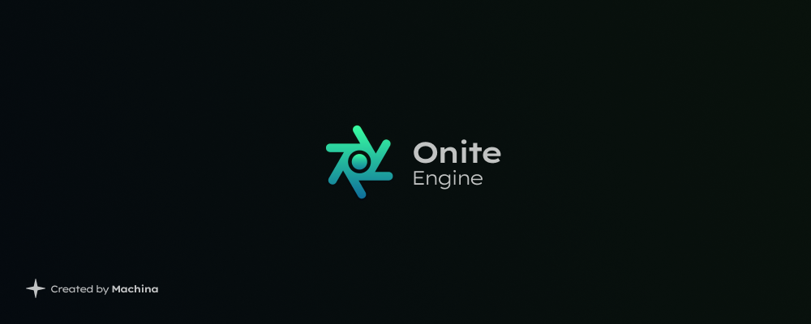

Onite
------

> [!IMPORTANT]
> Onite is under development.

Roadmap
------

> [!NOTE]
> More information on the development of the project will be added with time.

### 1. Engine:
  - [ ] AI (Artificial Intelligence)
  - [ ] Animation
  - [ ] Audio
  - [ ] Collision
  - [ ] Core
  - [ ] Gameplay
  - [ ] Graphics
  - [ ] Input
  - [ ] Network
  - [ ] Physics
  - [ ] Tools
  - [ ] UI (User Interface)
### 2. Blender (Game Editor Mode)
  - [ ] Game Editor View/Mode
  - [ ] Console/Message Log
  - [ ] Game Views
  - [ ] Game Project Preferences (Name, Description, Version, Locations, Renderer, Input Map, Multiplayer, Target Hardware ect.)
  - [ ] Add Project Browser (Textures, Objects, Colections, Actions, Materials, Worlds and Nodes/Scripts)
  - [ ] Game Nodes Editor (Global, World, Object)